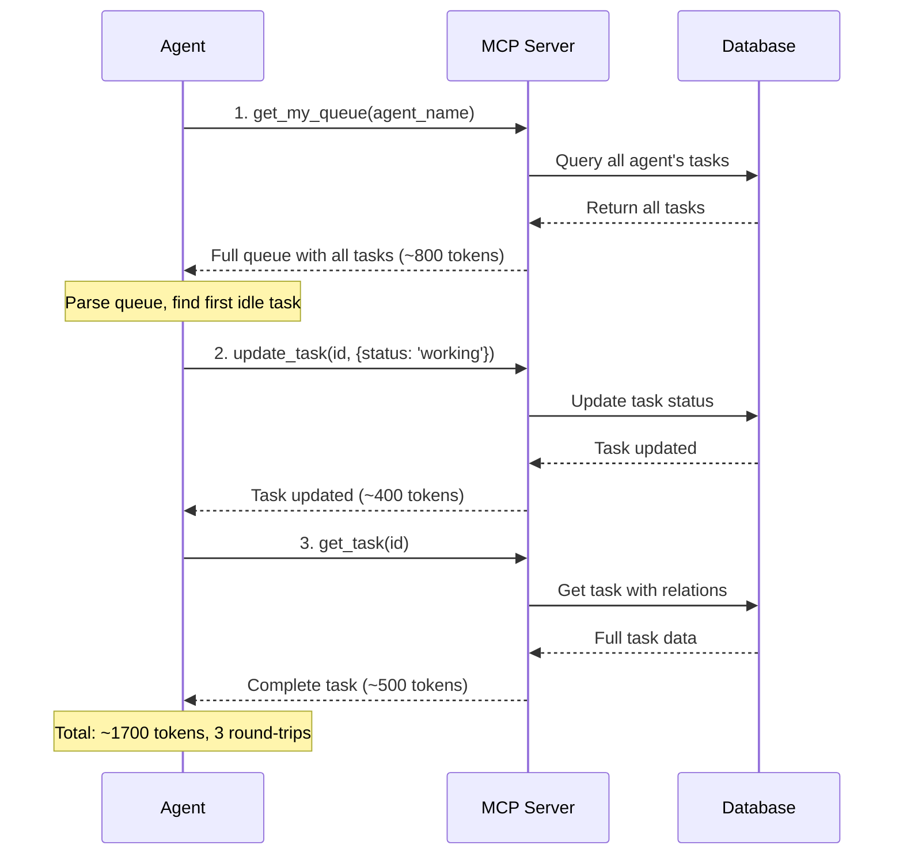
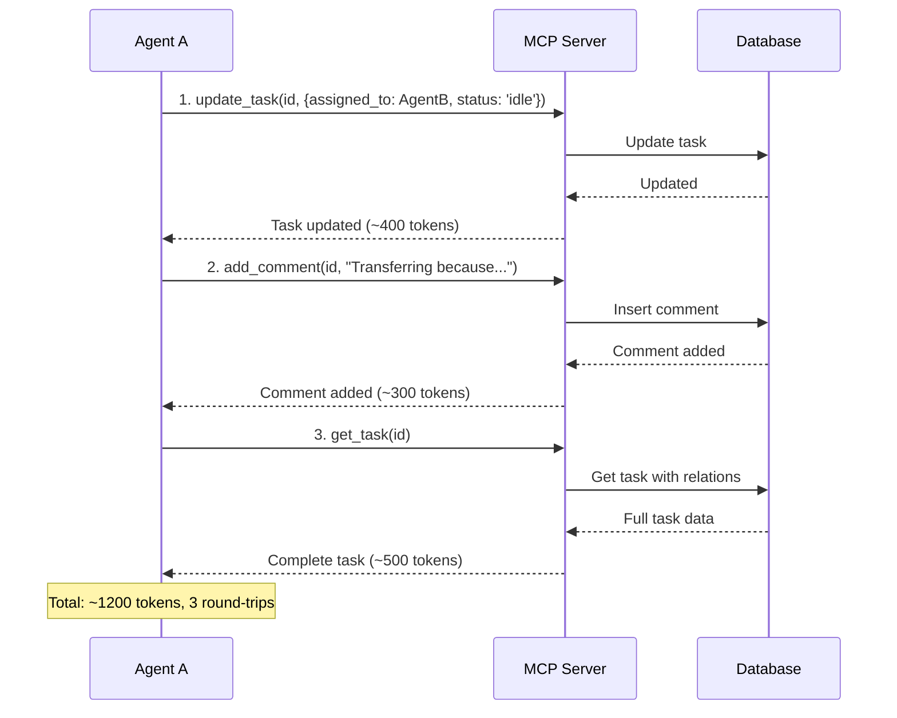
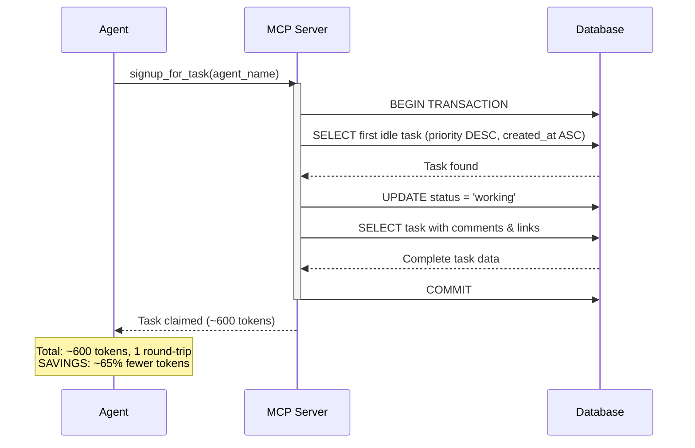
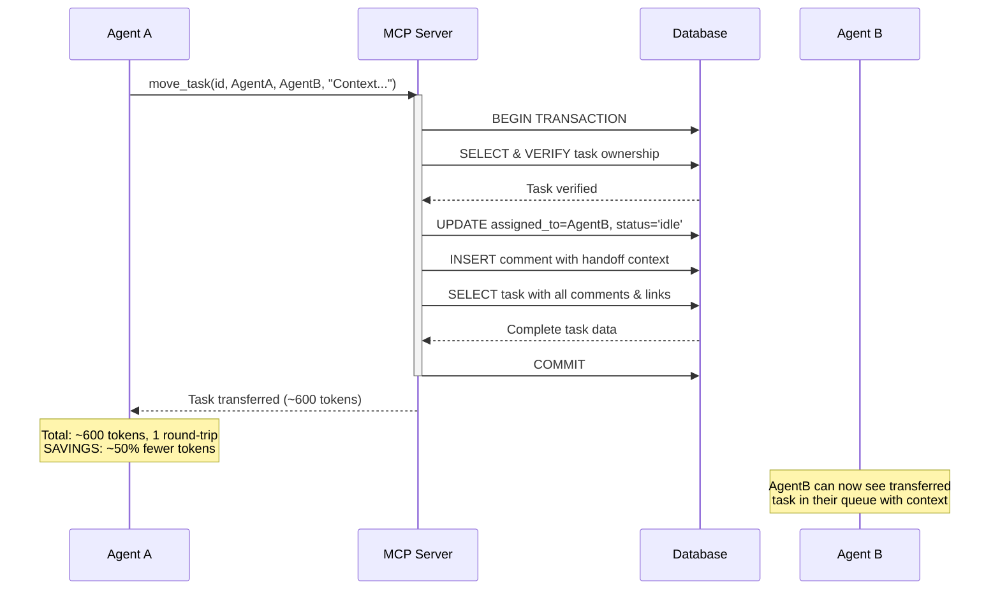
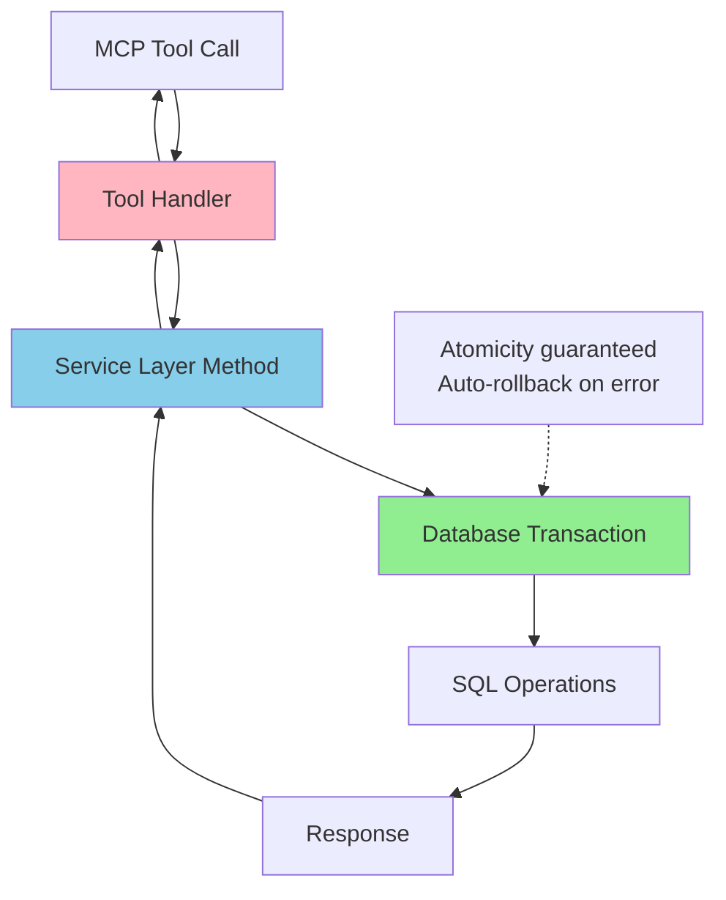
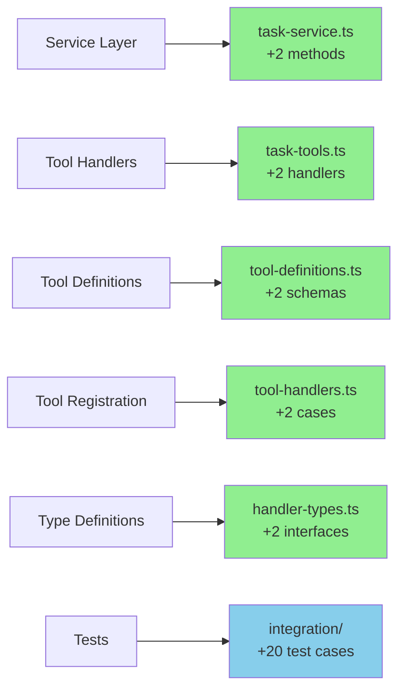
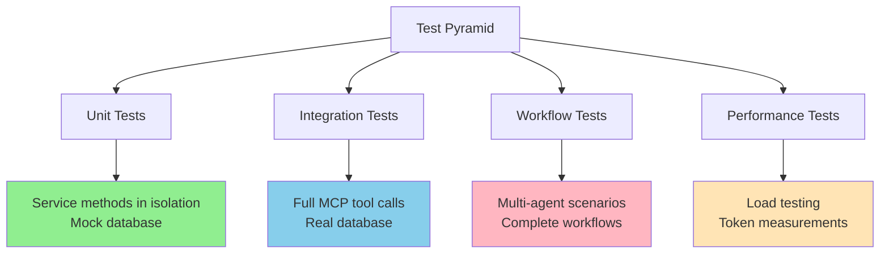
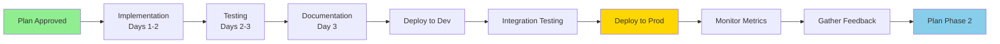

# High-Level Task Tools Implementation Plan

## Executive Summary

I've designed two new high-level task management tools that will reduce token consumption by **40-60%** for common agent workflows by combining multiple operations into single atomic transactions.

### The Two Tools

1. **`signup_for_task(agent_name)`** - Claim your next task in one call
2. **`move_task(task_id, current_agent, new_agent, comment)`** - Transfer a task with handoff in one call

### Expected Impact

- **Token Savings:** 15,000-20,000 tokens per agent per day
- **Efficiency Gain:** 3 tool calls → 1 tool call (67% reduction)
- **Reliability:** Atomic transactions prevent partial failures
- **Developer Experience:** Simpler workflows for agents

---

## Problem Statement

### Current State: Multiple Round-Trips Required

Agents currently need multiple sequential tool calls for common operations, each consuming tokens for request/response cycles.

#### Example 1: Signing Up For a Task (3+ calls)



#### Example 2: Transferring a Task (3+ calls)



---

## Proposed Solution

### Tool 1: `signup_for_task`

Single atomic operation to claim the next task from your queue.



**API Specification:**

```typescript
// Input
{
  agent_name: string
}

// Output (success)
{
  content: [{
    type: "text",
    text: "Task #123 claimed and set to working status\n\n{task_with_comments_and_links}"
  }]
}

// Output (no tasks)
{
  content: [{
    type: "text",
    text: "No idle tasks available in queue for agent: agent_name"
  }]
}
```

**Key Features:**
- ✅ Atomically claims highest priority idle task (higher numbers = higher priority)
- ✅ Updates status to 'working' in same transaction
- ✅ Returns complete task with comments and links
- ✅ Handles "no tasks available" gracefully
- ✅ Transaction rollback on any error

---

### Tool 2: `move_task`

Single atomic operation to transfer a task with handoff context.



**API Specification:**

```typescript
// Input
{
  task_id: number,
  current_agent: string,  // For verification
  new_agent: string,
  comment: string        // Handoff context
}

// Output (success)
{
  content: [{
    type: "text",
    text: "Task #123 transferred from AgentA to AgentB\n\n{task_with_comments_and_links}"
  }]
}

// Output (validation error)
{
  content: [{
    type: "text",
    text: "Task 123 is not assigned to AgentA"
  }],
  isError: true
}
```

**Key Features:**
- ✅ Verifies current agent ownership (prevents mistakes)
- ✅ Verifies task is in 'working' status
- ✅ Updates assignment and resets status to 'idle'
- ✅ Adds handoff comment atomically
- ✅ Returns complete task with all history
- ✅ Clear error messages for validation failures

---

## Technical Architecture

### Layered Design

Following existing TinyTask patterns:



### Database Transaction Pattern

Both tools use the same proven transaction pattern:

```typescript
signupForTask(agentName: string): TaskWithRelations | null {
  return this.db.transaction(() => {
    // 1. Query for first idle task
    const task = this.db.queryOne<Task>(
      `SELECT * FROM tasks 
       WHERE assigned_to = ? AND status = 'idle' AND archived_at IS NULL
       ORDER BY priority DESC, created_at ASC LIMIT 1`,
      [agentName]
    );
    
    if (!task) return null;
    
    // 2. Update status
    this.db.execute(
      'UPDATE tasks SET status = ?, updated_at = CURRENT_TIMESTAMP WHERE id = ?',
      ['working', task.id]
    );
    
    // 3. Get complete task with relations
    return this.get(task.id, true);
    
    // Auto-commit on success, auto-rollback on any error
  });
}
```

---

## Implementation Plan

### File Changes Required



### Implementation Phases

#### Phase 1: Core Implementation (Day 1-2)
- [ ] Add service layer methods (`TaskService.signupForTask`, `TaskService.moveTask`)
- [ ] Add tool handler functions
- [ ] Add Zod schemas and tool definitions
- [ ] Register tools with MCP server
- [ ] Add TypeScript type definitions

#### Phase 2: Testing (Day 2-3)
- [ ] Unit tests for service layer methods
- [ ] Integration tests for MCP tool calls
- [ ] Workflow tests for multi-agent scenarios
- [ ] Performance tests and benchmarking

#### Phase 3: Documentation & Deployment (Day 3)
- [ ] Update README and API documentation
- [ ] Add usage examples to workflow docs
- [ ] Update CHANGELOG
- [ ] Deploy and monitor

---

## Token Savings Analysis

### Per-Operation Comparison

| Operation | Current Approach | New Approach | Savings |
|-----------|------------------|--------------|---------|
| **Signup for Task** | ~1,700 tokens<br/>3 round-trips | ~600 tokens<br/>1 round-trip | **65% reduction** |
| **Transfer Task** | ~1,200 tokens<br/>3 round-trips | ~600 tokens<br/>1 round-trip | **50% reduction** |

### Projected Daily Savings

**Assumptions:**
- 5 agents working simultaneously
- Each agent: 10 task signups + 3 task transfers per day

**Calculations:**

```
Single Agent Daily:
- Signups: 10 × (1700 - 600) = 11,000 tokens saved
- Transfers: 3 × (1200 - 600) = 1,800 tokens saved
- Total per agent: 12,800 tokens/day

Multi-Agent System (5 agents):
- Daily savings: 12,800 × 5 = 64,000 tokens
- Monthly savings: 64,000 × 30 = 1,920,000 tokens
- Annual savings: 1,920,000 × 12 = 23,040,000 tokens
```

### Cost Impact

Using Claude Sonnet 3.5 pricing ($3/$15 per million tokens):

```
Monthly Savings:
- Input: 1.92M × $3 = $5.76
- Output: 1.92M × $15 = $28.80
- Total: ~$34.56/month per 5-agent deployment

Annual Savings: ~$414.72/year
```

**Note:** Savings scale linearly with number of agents and tasks processed.

---

## Testing Strategy

### Comprehensive Test Coverage



### Key Test Scenarios

**signup_for_task:**
1. ✅ Claims first idle task when available
2. ✅ Returns null when no idle tasks
3. ✅ Respects priority ordering (high → low)
4. ✅ Respects creation time (old → new)
5. ✅ Ignores working/complete tasks
6. ✅ Ignores archived tasks
7. ✅ Ignores tasks assigned to other agents
8. ✅ Transaction rolls back on error

**move_task:**
1. ✅ Successfully transfers task
2. ✅ Adds comment with context
3. ✅ Changes status from working → idle
4. ✅ Throws error if task not found
5. ✅ Throws error if wrong agent
6. ✅ Throws error if wrong status
7. ✅ Transaction rolls back on error

**Workflow:**
1. ✅ Complete agent handoff chain (A→B→C)
2. ✅ Multiple agents competing for tasks
3. ✅ Task lifecycle with new tools

---

## Risk Assessment & Mitigation

### Risk Matrix

| Risk | Impact | Probability | Mitigation |
|------|--------|-------------|------------|
| **Database lock contention** | Medium | Low | Use existing fast transaction patterns; monitor lock wait times |
| **Agent adoption friction** | Low | Medium | Keep old tools working; clear documentation |
| **Validation edge cases** | Medium | Low | Comprehensive test coverage; clear error messages |
| **Performance regression** | High | Very Low | Performance tests; identical patterns to existing code |

### Rollback Plan

If issues arise post-deployment:
1. New tools are additive - can be disabled without breaking existing functionality
2. Agents can fall back to existing multi-call patterns
3. Database changes are backward compatible
4. No schema migrations required

---

## Success Metrics

### Primary KPIs

1. **Token Reduction**
   - Target: 40-60% reduction for signup/transfer workflows
   - Measure: Compare token usage before/after adoption

2. **Execution Performance**
   - Target: < 100ms per tool operation
   - Measure: P50, P95, P99 latency metrics

3. **Error Rate**
   - Target: < 0.1% tool failure rate
   - Measure: Error count / total calls

### Secondary KPIs

4. **Adoption Rate**
   - Track usage of new tools vs old patterns
   - Target: > 80% adoption within 30 days

5. **Agent Productivity**
   - Measure: Tasks processed per agent per day
   - Target: 15-20% improvement

---

## Usage Examples

### Example 1: Agent Starting Work

**Before (3 calls):**
```typescript
// 1. Get queue
const queue = await get_my_queue({ agent_name: "agent-1" });
const idleTask = queue.tasks.find(t => t.status === 'idle');

// 2. Claim task
await update_task({ id: idleTask.id, status: 'working' });

// 3. Get full details
const task = await get_task({ id: idleTask.id });
```

**After (1 call):**
```typescript
// One atomic operation
const task = await signup_for_task({ agent_name: "agent-1" });
if (task) {
  // Start working immediately
} else {
  // No tasks available
}
```

### Example 2: Agent Transferring Task

**Before (3 calls):**
```typescript
// 1. Update assignment
await update_task({ 
  id: taskId, 
  assigned_to: "agent-2",
  status: 'idle'
});

// 2. Add context
await add_comment({
  task_id: taskId,
  content: "Transferring: I've completed initial analysis, needs coding expertise",
  created_by: "agent-1"
});

// 3. Verify transfer
const task = await get_task({ id: taskId });
```

**After (1 call):**
```typescript
// One atomic operation
const task = await move_task({
  task_id: taskId,
  current_agent: "agent-1",
  new_agent: "agent-2",
  comment: "Transferring: I've completed initial analysis, needs coding expertise"
});
```

---

## Questions for Review

### Design Decisions

1. **Should `signup_for_task` allow specifying task filters?**
   - Current: Claims first idle task (priority-ordered)
   - Alternative: Allow filtering by tags, priority range, etc.
   - Recommendation: Keep simple initially, add filters if needed

2. **Should `move_task` require task to be in 'working' status?**
   - Current: Yes, only transfer tasks you're actively working on
   - Alternative: Allow transferring idle tasks too
   - Recommendation: Keep strict for safety, can relax later

3. **Should we add `created_by` field to move_task comment?**
   - Current: Automatically uses `current_agent` as `created_by`
   - Alternative: Allow override
   - Recommendation: Automatic is safer and simpler

### Future Enhancements Priority

Which should we prioritize after Phase 1?
- [ ] `batch_signup_for_tasks(agent_name, count)` - Claim multiple tasks
- [ ] `complete_and_signup(task_id, agent_name)` - Complete current + claim next
- [ ] `auto_assign_tasks(agent_name, max_concurrent)` - Automatic management
- [ ] Token usage monitoring dashboard

---

## Next Steps

### Immediate Actions

1. **Review and Approve** this plan
2. **Create implementation task** if approved
3. **Assign developer** to implementation
4. **Set timeline** for delivery

### Post-Approval Workflow



### Implementation Timeline

- **Days 1-2:** Core implementation (service + tools + types)
- **Days 2-3:** Comprehensive testing
- **Day 3:** Documentation and deployment prep
- **Day 4:** Deploy to development environment
- **Day 5:** Integration testing and validation
- **Day 6:** Production deployment
- **Week 2:** Monitor metrics and gather feedback

---

## Documentation References

- **Technical Design:** [`docs/technical/high-level-task-tools.md`](../technical/high-level-task-tools.md:1)
- **Product Story:** [`docs/product-stories/high-level-tools/story-01-high-level-task-tools.md`](../product-stories/high-level-tools/story-01-high-level-task-tools.md:1)
- **Architecture:** [`docs/technical/architecture.md`](../technical/architecture.md:1)
- **Existing API Design:** [`docs/technical/mcp-api-design.md`](../technical/mcp-api-design.md:1)

---

## Approval

**Ready for Implementation:** ⬜ Yes ⬜ No ⬜ Needs Changes

**Approver:** ___________________ **Date:** ___________

**Notes:**

---
