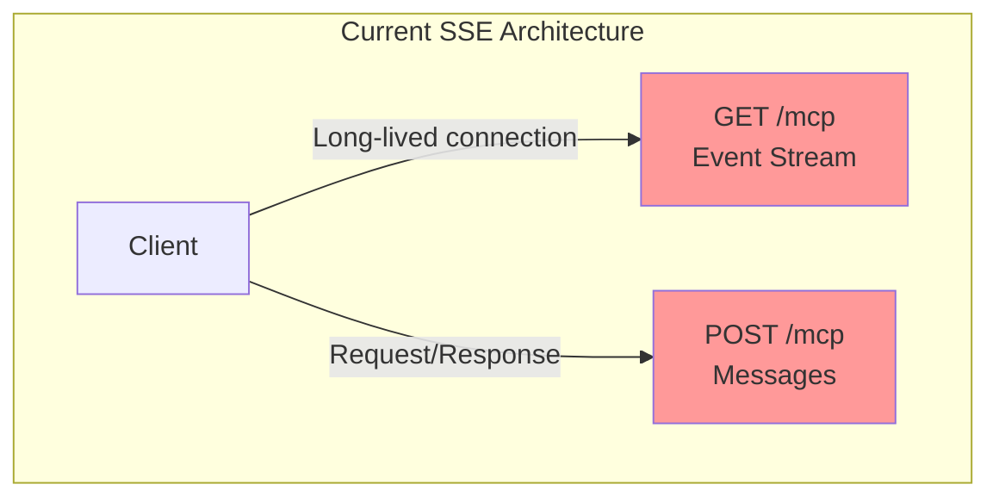
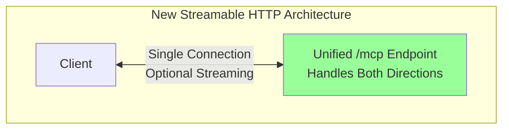
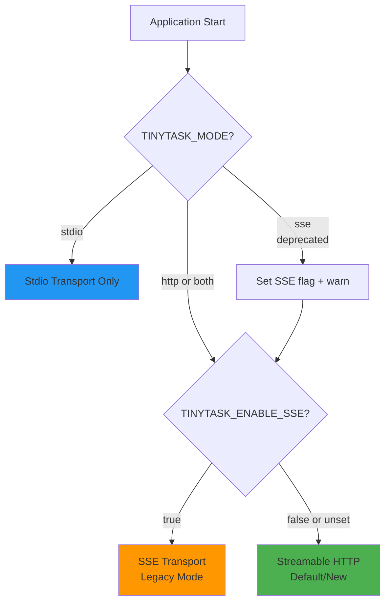
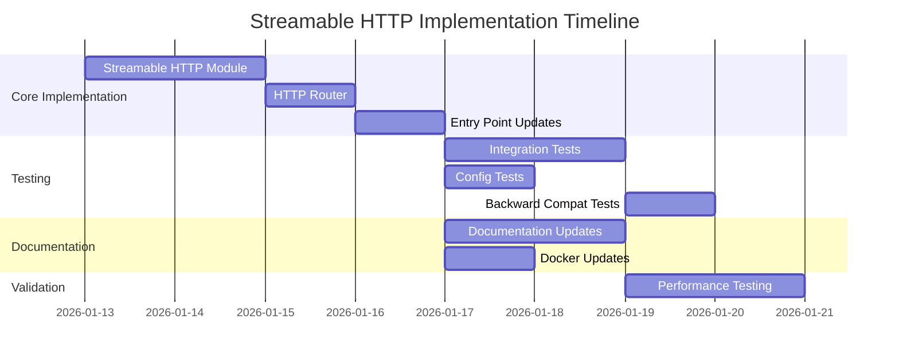
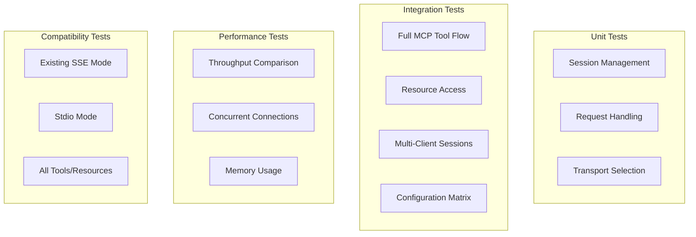

# Streamable HTTP Transport Implementation Plan

## Executive Summary

This plan outlines the implementation of Streamable HTTP as the new default HTTP transport for TinyTask MCP, replacing SSE while maintaining **100% backward compatibility** through runtime configuration.

### Key Changes
- ✨ **New Default**: Streamable HTTP transport (more efficient, simpler)
- 🔄 **Backward Compatible**: Existing SSE deployments continue to work
- ⚙️ **Runtime Configuration**: Single environment variable controls transport selection
- 📦 **Zero Breaking Changes**: All existing configurations supported
- 🎯 **Improved Performance**: 10-20% expected improvement in connection efficiency

### Timeline
**Estimated: 2.5 weeks (13 development days)**

---

## The Problem We're Solving

### Current State: SSE Transport Issues


**Problems:**
- Requires two separate endpoints (GET for events, POST for messages)
- Maintains long-lived persistent connections per client
- Higher TCP connection count under load
- More complex dual-channel client logic
- Higher resource usage

### Proposed State: Streamable HTTP


**Benefits:**
- Single unified `/mcp` endpoint
- Optional streaming on a single connection
- Fewer persistent connections
- Simpler client configuration
- Better scalability
- Native session management with resumption

---

## Architecture Overview

### Configuration-Based Transport Selection



### New File Structure

```
src/server/
├── stdio.ts              # Existing - No changes
├── sse.ts                # Existing - Marked as legacy
├── streamable-http.ts    # NEW - Streamable HTTP implementation
├── http.ts               # NEW - Transport router
└── mcp-server.ts         # Existing - No changes
```

---

## Configuration Design

### Environment Variables

| Variable | Values | Default | Description |
|----------|--------|---------|-------------|
| `TINYTASK_MODE` | `stdio`, `http`, `both` | `both` | Server mode |
| `TINYTASK_ENABLE_SSE` | `true`, `false` | `false` | Enable legacy SSE (new) |
| `TINYTASK_PORT` | number | `3000` | HTTP server port |
| `TINYTASK_HOST` | string | `0.0.0.0` | HTTP server host |

### Configuration Examples

#### Default (Streamable HTTP)
```bash
TINYTASK_MODE=http
TINYTASK_PORT=3000
```

#### Legacy SSE Mode (Backward Compatible)
```bash
TINYTASK_MODE=http
TINYTASK_ENABLE_SSE=true
TINYTASK_PORT=3000
```

#### Both Transports with Streamable HTTP
```bash
TINYTASK_MODE=both
TINYTASK_PORT=3000
```

#### Old Configuration (Still Works)
```bash
TINYTASK_MODE=sse  # Logs deprecation warning, maps to http+SSE
```

---

## Migration Path for Users

### Option 1: Do Nothing (Zero Risk)
Existing configurations continue to work exactly as before:
```bash
# This still works, no changes needed
TINYTASK_MODE=sse
```
⚠️ Will see deprecation warning in logs

### Option 2: Explicit SSE (Recommended if staying with SSE)
```bash
# Before
TINYTASK_MODE=sse

# After (clearer intent)
TINYTASK_MODE=http
TINYTASK_ENABLE_SSE=true
```

### Option 3: Migrate to Streamable HTTP (Get Benefits)
```bash
# Simply remove SSE flag or use new default
TINYTASK_MODE=http
```

**Benefits:** Better performance, simpler setup, future-proof

---

## Implementation Stories

### Story Breakdown

| # | Story | Effort | Description |
|---|-------|--------|-------------|
| 1.1 | Streamable HTTP Module | 2 days | Core implementation |
| 1.2 | HTTP Router | 1 day | Transport selection logic |
| 1.3 | Entry Point Updates | 1 day | Mode normalization |
| 1.4 | Package Scripts | 0.5 days | npm run commands |
| 1.5 | Integration Tests | 2 days | Full transport testing |
| 1.6 | Config Tests | 1 day | Transport selection tests |
| 1.7 | Documentation | 2 days | User-facing docs |
| 1.8 | Docker Updates | 1 day | Container configs |
| 1.9 | Performance Tests | 1.5 days | Benchmarking |
| 1.10 | Backward Compat | 1 day | Verification |

**Total: ~13 days (2.5 weeks)**

### Critical Path


---

## Technical Implementation Highlights

### Streamable HTTP Server Core
```typescript
// src/server/streamable-http.ts
import { StreamableHTTPServerTransport } from '@modelcontextprotocol/sdk/server/streamableHttp.js';

export async function startStreamableHttpServer(
  taskService: TaskService,
  commentService: CommentService,
  linkService: LinkService,
  options?: HttpServerOptions
): Promise<void> {
  const app = express();
  const sessions = new Map<string, { transport, server }>();

  // Unified MCP endpoint
  app.use('/mcp', async (req, res) => {
    let sessionId = req.headers['mcp-session-id'] as string;
    
    // Create or retrieve session
    let session = sessions.get(sessionId);
    if (!session) {
      const transport = new StreamableHTTPServerTransport();
      const server = createMcpServer(taskService, commentService, linkService);
      await server.connect(transport);
      sessionId = generateSessionId();
      session = { transport, server };
      sessions.set(sessionId, session);
      res.setHeader('Mcp-Session-Id', sessionId);
    }
    
    // Handle request
    await session.transport.handleRequest(req, res);
  });

  app.listen(port, host);
}
```

### Transport Router
```typescript
// src/server/http.ts
export async function startHttpServer(
  taskService: TaskService,
  commentService: CommentService,
  linkService: LinkService,
  options?: HttpServerOptions
): Promise<void> {
  const enableSse = process.env.TINYTASK_ENABLE_SSE === 'true';
  
  if (enableSse) {
    logger.info('🔄 Using SSE transport (legacy mode)');
    return startSseServer(taskService, commentService, linkService, options);
  } else {
    logger.info('✨ Using Streamable HTTP transport');
    return startStreamableHttpServer(taskService, commentService, linkService, options);
  }
}
```

---

## Testing Strategy

### Test Coverage



### Test Files
- `tests/unit/streamable-http-transport.test.ts`
- `tests/integration/streamable-http.test.ts`
- `tests/integration/transport-configuration.test.ts`
- `tests/integration/backward-compatibility.test.ts`
- `tests/performance/transport-comparison.test.ts`

---

## Risk Analysis & Mitigation

| Risk | Probability | Impact | Mitigation |
|------|-------------|--------|------------|
| Breaking existing deployments | Low | High | Full backward compatibility, extensive testing |
| Streamable HTTP bugs | Medium | Medium | Keep SSE as fallback, gradual rollout |
| Client incompatibility | Low | Medium | Verify MCP SDK version, update docs |
| Performance regression | Low | Medium | Performance testing before release, monitoring |
| Documentation gaps | Medium | Low | Comprehensive docs, migration guide, examples |

---

## Success Criteria

### Must Have (MVP)
- [ ] All existing tests pass without modification
- [ ] Zero breaking changes for existing deployments
- [ ] New Streamable HTTP tests achieve >90% coverage
- [ ] SSE mode continues to work when flag is set
- [ ] Documentation is complete and accurate
- [ ] Docker images build and run successfully

### Should Have
- [ ] 10-20% improvement in connection efficiency
- [ ] Reduced memory footprint in HTTP mode
- [ ] Improved response times
- [ ] Clear migration guide published
- [ ] Performance comparison documented

### Nice to Have
- [ ] Performance monitoring dashboard
- [ ] Automated migration tool
- [ ] Transport selection diagnostic tool

---

## Documentation Deliverables

### Updated Documents
1. **README.md** - Quick start with new transport
2. **docs/technical/architecture.md** - Architecture diagrams updated
3. **docs/technical/streamable-http-transport-design.md** - Full technical design ✅
4. **docs/deployment.md** - Deployment examples updated
5. **agents.md** - Environment variables updated

### New Documents
1. **docs/product/streamable-http-migration-guide.md** - User migration guide
2. **docs/technical/streamable-http-performance.md** - Performance comparison
3. **docs/product-stories/streamable-http-transport/story-01-streamable-http-transport.md** - Implementation stories ✅

---

## Rollback Plan

If critical issues are discovered after deployment:

1. **Immediate Action**: Advise users to set `TINYTASK_ENABLE_SSE=true`
2. **No Code Rollback Needed**: Backward compatibility means SSE is always available
3. **Fix Issues**: Address Streamable HTTP implementation bugs
4. **Re-enable**: Remove SSE flag after fixes are verified
5. **Communication**: Clear user communication about status

---

## Open Questions

### Question 1: SSE Deprecation Timeline
**Should we set a timeline for removing SSE support entirely?**

**Recommendation:** Keep SSE for at least 6 months after Streamable HTTP is stable, then evaluate based on:
- User adoption of Streamable HTTP
- Any issues discovered
- User feedback

### Question 2: Side-by-Side Testing
**Should we provide a tool to test both transports side-by-side?**

**Recommendation:** Create a simple test script that validates both transports are working correctly during development.

### Question 3: Monitoring
**How should we handle monitoring/metrics for different transport types?**

**Recommendation:** Add transport type to all log messages so they can be filtered/aggregated.

---

## Next Steps

### Upon Approval
1. **Switch to Code Mode** - Begin implementation
2. **Story 1.1** - Create Streamable HTTP module
3. **Story 1.2** - Create HTTP router
4. **Story 1.3** - Update entry point
5. **Continue** - Follow story sequence

### Questions for You
1. **Do you approve this approach?** (Runtime config, backward compatible)
2. **Any concerns about the migration path?**
3. **Should we start with a specific story or the full sequence?**
4. **Any additional requirements or constraints?**

---

## References
- **Technical Design**: [`docs/technical/streamable-http-transport-design.md`](../technical/streamable-http-transport-design.md)
- **Implementation Stories**: [`docs/product-stories/streamable-http-transport/story-01-streamable-http-transport.md`](../product-stories/streamable-http-transport/story-01-streamable-http-transport.md)
- **Current SSE Implementation**: [`src/server/sse.ts`](../../src/server/sse.ts)
- **Current Entry Point**: [`src/index.ts`](../../src/index.ts)
- **MCP Specification**: https://modelcontextprotocol.io/docs/concepts/transports
