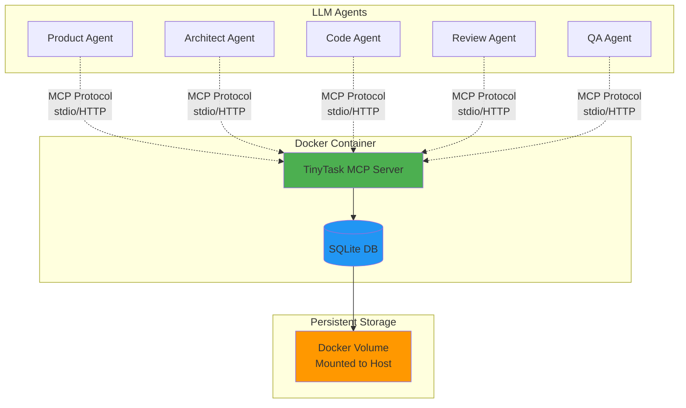
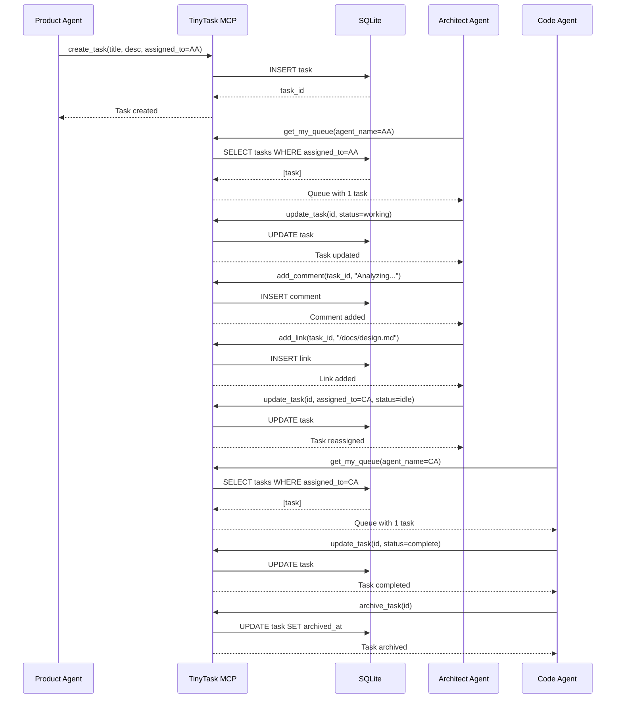
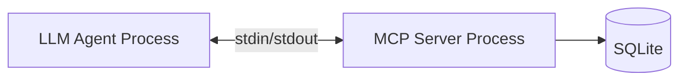
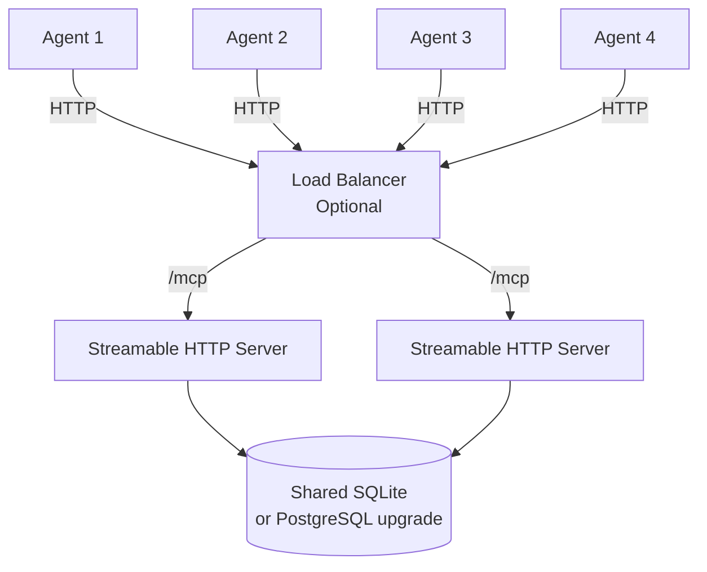
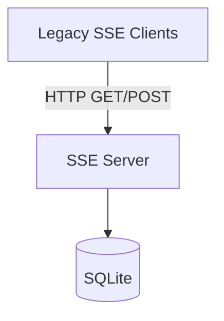

# TinyTask System Architecture

## Overview
TinyTask is an MCP server that provides task management for LLM agent collaboration. It supports stdio (local) plus HTTP-based transports where Streamable HTTP is the default and SSE remains as a legacy option.

## High-Level Architecture



## Component Architecture

```mermaid
graph TB
    subgraph "MCP Server"
        SERVER[Server Core]
        STDIO[Stdio Transport]
        HTTP_ROUTER[HTTP Transport Router]
        STREAMABLE[Streamable HTTP]
        SSE[SSE Transport (Legacy)]
        
        subgraph "API Layer"
            TOOLS[Tools Handler]
            RESOURCES[Resources Handler]
        end
        
        subgraph "Business Logic"
            TASK_SVC[Task Service]
            COMMENT_SVC[Comment Service]
            LINK_SVC[Link Service]
        end
        
        subgraph "Data Layer"
            DB_CLIENT[Database Client]
            SCHEMA[Schema Manager]
        end
        
        SERVER --> STDIO
        SERVER --> HTTP_ROUTER
        HTTP_ROUTER --> STREAMABLE
        HTTP_ROUTER --> SSE
        SERVER --> TOOLS
        SERVER --> RESOURCES
        
        TOOLS --> TASK_SVC
        TOOLS --> COMMENT_SVC
        TOOLS --> LINK_SVC
        
        RESOURCES --> TASK_SVC
        RESOURCES --> COMMENT_SVC
        RESOURCES --> LINK_SVC
        
        TASK_SVC --> DB_CLIENT
        COMMENT_SVC --> DB_CLIENT
        LINK_SVC --> DB_CLIENT
        
        DB_CLIENT --> SCHEMA
    end
    
    SCHEMA --> SQLITE[(SQLite DB)]
```

## Data Flow

### Agent Task Workflow



## HTTP Transport Routing

The HTTP transport layer is orchestrated by [`src/server/http.ts`](src/server/http.ts:1). It inspects runtime configuration and starts exactly one HTTP transport implementation per process.

```mermaid
flowchart LR
    ENV[TINYTASK_MODE +\nTINYTASK_ENABLE_SSE]
    ROUTER[HTTP Router\n(src/server/http.ts)]
    STREAMABLE[Streamable HTTP\n(src/server/streamable-http.ts)]
    SSE[SSE Transport\n(src/server/sse.ts)]

    ENV --> ROUTER
    ROUTER -->|default| STREAMABLE
    ROUTER -->|legacy flag| SSE
```

- **Default path**: Streamable HTTP provides a unified `/mcp` endpoint and session management.
- **Legacy path**: When `TINYTASK_ENABLE_SSE=true`, the router starts the SSE transport for backward compatibility.
- **Safety**: Prevents dual HTTP transports from running simultaneously.

## Transport Modes

### Stdio Mode (Local Development)



**Use Case:** Single-agent testing, local development
**Connection:** Direct process communication
**Configuration:** MCP settings with `command` and `args`

### Streamable HTTP Mode (Default HTTP)



**Use Case:** Multiple agents on different machines/containers
**Connection:** Streamable HTTP unified `/mcp` endpoint (bidirectional)
**Port:** 3000 (configurable)
**Configuration:** MCP settings with `url`

### SSE Mode (Legacy Production)



**Use Case:** Backward compatibility until all clients migrate
**Connection:** Server-Sent Events stream + POST messages
**Activation:** Set `TINYTASK_ENABLE_SSE=true`

## Database Architecture

### SQLite Configuration

- **File Location:** `/data/tinytask.db` (inside container)
- **Journal Mode:** WAL (Write-Ahead Logging) for better concurrency
- **Foreign Keys:** Enabled for referential integrity
- **Backup Strategy:** Volume mapped to host for persistence

### Schema Organization

```
SQLite Database: tinytask.db
├── tasks (primary entity)
│   ├── PK: id
│   ├── Indexes: assigned_to, status, (assigned_to, status)
│   └── Soft delete: archived_at
├── comments (1-to-many with tasks)
│   ├── PK: id
│   ├── FK: task_id → tasks(id) ON DELETE CASCADE
│   └── Index: task_id
├── links (1-to-many with tasks)
│   ├── PK: id
│   ├── FK: task_id → tasks(id) ON DELETE CASCADE
│   └── Index: task_id
└── task_history (optional audit trail)
    ├── PK: id
    ├── FK: task_id → tasks(id) ON DELETE CASCADE
    └── Index: task_id
```

## Scaling Considerations

### Current MVP Scope
- **Single MCP server instance**
- **SQLite database** (sufficient for 10-100 agents)
- **File-based persistence**

### Future Scaling Path
If needed beyond MVP:

1. **Database Upgrade:**
   - SQLite → PostgreSQL for true multi-instance support
   - Connection pooling
   - Read replicas

2. **Horizontal Scaling:**
   - Multiple MCP server instances behind load balancer
   - Shared database
   - Session affinity not required (stateless)

3. **Monitoring:**
   - Task queue depth metrics
   - Agent activity tracking
   - Performance monitoring

## Security Considerations

### MVP Security
- **No authentication** (trusted internal network assumed)
- **No authorization** (agents can access all tasks)
- **No encryption** (stdio mode is process-local, SSE on localhost)

### Production Hardening (Future)
- API key authentication
- Agent-level permissions
- TLS for SSE mode
- Rate limiting
- Audit logging

## Technology Stack

### Core
- **Runtime:** Node.js 20+
- **Language:** TypeScript
- **Framework:** @modelcontextprotocol/sdk

### Database
- **SQLite3** with better-sqlite3 driver
- **Schema Management:** SQL files executed on startup

### Transport
- **Stdio:** Built-in MCP SDK support
- **Streamable HTTP:** Express + StreamableHTTPServerTransport
- **SSE:** Express + SSEServerTransport (legacy)

### Container
- **Base Image:** node:20-alpine
- **Size Target:** < 100MB
- **Startup Time:** < 2 seconds

## Configuration

### Environment Variables

```bash
# Server mode
TINYTASK_MODE=stdio|http|both  # Default: both

# HTTP transport selection
TINYTASK_ENABLE_SSE=true|false  # Default: false (Streamable HTTP)

# HTTP configuration
TINYTASK_PORT=3000  # Default: 3000
TINYTASK_HOST=0.0.0.0  # Default: 0.0.0.0

# Database
TINYTASK_DB_PATH=/data/tinytask.db  # Default: /data/tinytask.db

# Optional features
TINYTASK_ENABLE_HISTORY=true|false  # Default: false
TINYTASK_LOG_LEVEL=debug|info|warn|error  # Default: info
```

| Scenario | `TINYTASK_MODE` | `TINYTASK_ENABLE_SSE` | Result |
| --- | --- | --- | --- |
| Stdio only | `stdio` | any | Stdio transport only |
| Default HTTP | `http` | _unset_ / `false` | Streamable HTTP |
| Mixed stdio + HTTP | `both` | _unset_ / `false` | Stdio + Streamable HTTP |
| Legacy SSE | `http` | `true` | SSE transport |
| Legacy SSE + stdio | `both` | `true` | Stdio + SSE |

### Volume Mounts

```bash
# Database persistence
-v /host/path/data:/data

# Optional: Custom configuration
-v /host/path/config:/config
```

## Project Structure

```
tinytask-mcp/
├── src/
│   ├── index.ts              # Entry point, mode selection
│   ├── server/
│   │   ├── mcp-server.ts     # MCP server setup
│   │   ├── stdio.ts          # Stdio transport
│   │   ├── streamable-http.ts# Streamable HTTP transport
│   │   ├── sse.ts            # SSE transport (legacy)
│   │   └── http.ts           # HTTP transport router
│   ├── tools/
│   │   ├── task-tools.ts     # Task CRUD tools
│   │   ├── comment-tools.ts  # Comment CRUD tools
│   │   └── link-tools.ts     # Link CRUD tools
│   ├── resources/
│   │   ├── task-resources.ts
│   │   └── queue-resources.ts
│   ├── services/
│   │   ├── task-service.ts
│   │   ├── comment-service.ts
│   │   └── link-service.ts
│   ├── db/
│   │   ├── client.ts         # Database client
│   │   ├── schema.sql        # Table definitions
│   │   └── init.ts           # Database initialization
│   └── types/
│       └── index.ts          # TypeScript types
├── Dockerfile
├── docker-compose.yml
├── package.json
├── tsconfig.json
└── README.md
```

## Deployment Modes

### Mode 1: Stdio (Local)
```json
{
  "mcpServers": {
    "tinytask": {
      "command": "node",
      "args": ["/path/to/tinytask-mcp/build/index.js"],
      "env": {
        "TINYTASK_MODE": "stdio",
        "TINYTASK_DB_PATH": "/path/to/data/tinytask.db"
      }
    }
  }
}
```

### Mode 2: Streamable HTTP (Remote)
```json
{
  "mcpServers": {
    "tinytask": {
      "url": "http://localhost:3000/mcp"
    }
  }
}
```

### Mode 3: Docker + Streamable HTTP (Production)
```bash
docker run -d \
  -p 3000:3000 \
  -v /host/data:/data \
  -e TINYTASK_MODE=http \
  tinytask-mcp:latest
```
Add `-e TINYTASK_ENABLE_SSE=true` only if the deployment must stay on SSE.
