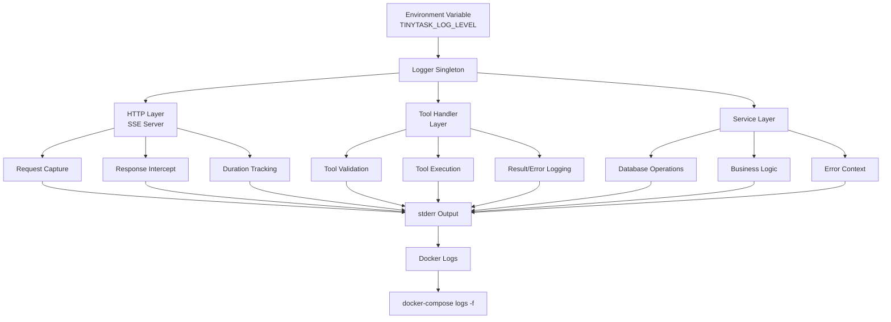
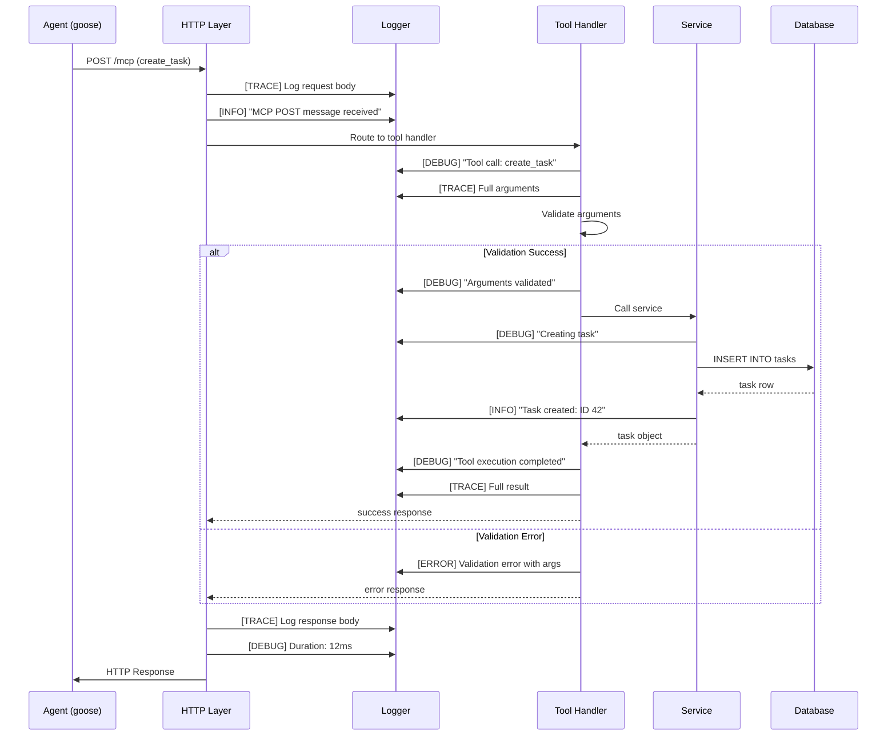

# Forensic Logging Architecture

## Executive Summary

This document describes the architecture for adding comprehensive, environment-controlled forensic logging to the TinyTask MCP server. The goal is to enable deep debugging of agent interactions while maintaining production performance and backward compatibility.

## Problem Statement

The current logging provides minimal visibility:
```
tinytask-mcp | MCP POST message received
```

This is insufficient for debugging agent integration issues such as:
- Invalid request formats
- Validation failures
- Data transformation errors
- Unexpected response formats

## Solution Overview

Implement a **hierarchical logging system** with 5 levels controlled by a single environment variable (`TINYTASK_LOG_LEVEL`), where higher levels enable full request/response capture for forensic analysis.

### Key Features

1. **Environment-Controlled**: Single variable toggles logging level
2. **Performance-Conscious**: Zero overhead when disabled, minimal when enabled
3. **Backward Compatible**: Default behavior unchanged
4. **Comprehensive**: Covers HTTP, tool, and service layers
5. **Structured**: Consistent format with timestamps and context

## Logging Levels

| Level | Value | Use Case | What's Logged |
|-------|-------|----------|---------------|
| **ERROR** | 0 | Production (errors only) | Errors with full context |
| **WARN** | 1 | Production (stable) | Warnings + errors |
| **INFO** | 2 | Production (default) | Operations summary + warnings + errors |
| **DEBUG** | 3 | Development | Tool calls, validation, operations + all above |
| **TRACE** | 4 | Forensic debugging | Full request/response bodies + all above |

## Architecture Diagram



## Request Flow with Logging



## Component Design

### 1. Logger Utility (`src/utils/logger.ts`)

**Purpose**: Centralized logging with level-based filtering

**Key Methods**:
- `error(message, context?)` - Error logging with stack traces
- `warn(message, context?)` - Warning messages
- `info(message, context?)` - Informational messages
- `debug(message, context?)` - Debug information
- `trace(message, context?)` - Forensic-level detail
- `logRequest(...)` - Specialized HTTP request logging
- `logResponse(...)` - Specialized HTTP response logging
- `logToolCall(...)` - Tool invocation logging
- `logToolResult(...)` - Tool result logging
- `logToolError(...)` - Enhanced tool error logging

**Features**:
- Singleton pattern for consistent configuration
- Lazy evaluation (checks level before formatting)
- Automatic timestamp generation
- Context object serialization
- Argument sanitization for readability

### 2. SSE Server Updates (`src/server/sse.ts`)

**Logging Points**:

1. **Connection Events**
   - INFO: New connection, session established/closed
   - DEBUG: Connection details (IP, session ID)

2. **Request Processing**
   - INFO: Request received summary
   - TRACE: Full request headers and body
   - DEBUG: Session lookup, validation steps

3. **Response Processing**
   - TRACE: Full response body
   - DEBUG: Duration tracking
   - ERROR: Processing failures with context

**Implementation Strategy**:
- Request body capture without consuming SDK stream
- Response interception via middleware
- Duration calculation via timestamps

### 3. Tool Handler Updates (`src/tools/tool-handlers.ts`)

**Logging Points**:

1. **Tool Call Reception**
   - DEBUG: Tool name and sanitized arguments
   - TRACE: Full arguments

2. **Validation**
   - DEBUG: Validation success
   - ERROR: Validation failure with attempted arguments

3. **Execution**
   - DEBUG: Execution start/complete with duration
   - TRACE: Full result object
   - ERROR: Execution failure with full context

4. **Routing**
   - WARN: Unknown tool names
   - DEBUG: Handler routing decisions

### 4. Service Layer Updates (Optional Phase)

**Logging Points**:
- DEBUG: Database operations (CREATE, UPDATE, DELETE)
- DEBUG: Business logic decisions
- ERROR: Database errors with SQL context
- TRACE: Full query parameters

## Log Output Examples

### Scenario: Successful Task Creation

#### INFO Level (Default)
```
[2025-12-27T18:45:00.123Z] INFO: MCP POST message received
[2025-12-27T18:45:00.135Z] INFO: Task created successfully: 42
  { "title": "Test Task" }
```

#### DEBUG Level
```
[2025-12-27T18:45:00.123Z] INFO: MCP POST message received
[2025-12-27T18:45:00.124Z] DEBUG: Tool call received: create_task
[2025-12-27T18:45:00.125Z] DEBUG: Tool arguments validated: create_task
[2025-12-27T18:45:00.126Z] DEBUG: Executing create_task handler
[2025-12-27T18:45:00.134Z] INFO: Task created successfully: 42
  { "title": "Test Task" }
[2025-12-27T18:45:00.135Z] DEBUG: Tool execution completed: create_task
  { "duration": "10ms" }
[2025-12-27T18:45:00.136Z] DEBUG: Request processed successfully
  { "duration": "13ms" }
```

#### TRACE Level (Forensic)
```
[2025-12-27T18:45:00.123Z] INFO: MCP POST message received
[2025-12-27T18:45:00.124Z] TRACE: Request headers
{
  "headers": {
    "content-type": "application/json",
    "x-session-id": "abc123"
  },
  "sessionId": "abc123"
}
[2025-12-27T18:45:00.124Z] TRACE: Request body
{
  "body": {
    "jsonrpc": "2.0",
    "id": 1,
    "method": "tools/call",
    "params": {
      "name": "create_task",
      "arguments": {
        "title": "Test Task",
        "description": "Testing task creation",
        "assigned_to": "goose",
        "priority": 1
      }
    }
  }
}
[2025-12-27T18:45:00.125Z] DEBUG: Tool call received: create_task
[2025-12-27T18:45:00.125Z] TRACE: Tool call arguments
{
  "name": "create_task",
  "args": {
    "title": "Test Task",
    "description": "Testing task creation",
    "assigned_to": "goose",
    "priority": 1
  }
}
[2025-12-27T18:45:00.126Z] DEBUG: Tool arguments validated: create_task
[2025-12-27T18:45:00.126Z] DEBUG: Executing create_task handler
[2025-12-27T18:45:00.127Z] DEBUG: Creating task
  { "title": "Test Task", "assigned_to": "goose" }
[2025-12-27T18:45:00.134Z] INFO: Task created successfully: 42
  { "title": "Test Task" }
[2025-12-27T18:45:00.134Z] TRACE: Created task details
{
  "id": 42,
  "title": "Test Task",
  "description": "Testing task creation",
  "status": "idle",
  "assigned_to": "goose",
  "created_by": null,
  "priority": 1,
  "tags": [],
  "created_at": "2025-12-27T18:45:00.000Z",
  "updated_at": "2025-12-27T18:45:00.000Z",
  "archived_at": null
}
[2025-12-27T18:45:00.135Z] DEBUG: Tool execution completed: create_task
  { "duration": "10ms" }
[2025-12-27T18:45:00.135Z] TRACE: Tool execution result
{
  "name": "create_task",
  "result": {
    "content": [{
      "type": "text",
      "text": "{ \"id\": 42, \"title\": \"Test Task\", ... }"
    }]
  }
}
[2025-12-27T18:45:00.136Z] TRACE: HTTP Response
{
  "status": 200,
  "duration": 13,
  "body": {
    "jsonrpc": "2.0",
    "id": 1,
    "result": {
      "content": [{
        "type": "text",
        "text": "{ \"id\": 42, \"title\": \"Test Task\", ... }"
      }]
    }
  }
}
[2025-12-27T18:45:00.136Z] DEBUG: Request processed successfully
  { "duration": "13ms" }
```

### Scenario: Validation Error

#### TRACE Level
```
[2025-12-27T18:45:00.123Z] INFO: MCP POST message received
[2025-12-27T18:45:00.124Z] TRACE: Request body
{
  "body": {
    "jsonrpc": "2.0",
    "id": 2,
    "method": "tools/call",
    "params": {
      "name": "create_task",
      "arguments": {
        "description": "Missing title field"
      }
    }
  }
}
[2025-12-27T18:45:00.125Z] DEBUG: Tool call received: create_task
[2025-12-27T18:45:00.125Z] ERROR: Tool execution failed: create_task
{
  "error": "Invalid type: Expected string for field 'title'",
  "stack": "ZodError: ...",
  "args": {
    "description": "Missing title field"
  },
  "duration": "1ms"
}
[2025-12-27T18:45:00.126Z] TRACE: HTTP Response
{
  "status": 200,
  "body": {
    "jsonrpc": "2.0",
    "id": 2,
    "result": {
      "content": [{
        "type": "text",
        "text": "Error calling tool create_task: Invalid type: Expected string for field 'title'"
      }],
      "isError": true
    }
  }
}
```

## Configuration

### Environment Variable

```bash
# Set globally
export TINYTASK_LOG_LEVEL=trace

# Or per-command
TINYTASK_LOG_LEVEL=debug npm run dev
```

### Docker Compose

```yaml
environment:
  TINYTASK_LOG_LEVEL: trace  # error|warn|info|debug|trace
```

### MCP Client Config (stdio mode)

```json
{
  "mcpServers": {
    "tinytask": {
      "command": "node",
      "args": ["/path/to/build/index.js"],
      "env": {
        "TINYTASK_MODE": "stdio",
        "TINYTASK_LOG_LEVEL": "debug"
      }
    }
  }
}
```

## Performance Impact

### Design Considerations

1. **Lazy Evaluation**: Level check happens before expensive operations
   ```typescript
   if (this.shouldLog(LogLevel.TRACE)) {
     this.trace('Data', expensiveSerialize(data));
   }
   ```

2. **No Buffering**: Logs written directly to stderr
3. **Stream Preservation**: Request capture doesn't interfere with SDK

### Benchmarks (Expected)

| Level | Overhead per Request | Use Case |
|-------|---------------------|----------|
| ERROR | 0ms | Production |
| INFO | <1ms | Production |
| DEBUG | 1-2ms | Development |
| TRACE | 3-5ms | Troubleshooting only |

## Security Considerations

### Current Scope
- No automatic PII filtering
- All data logged as-is
- Suitable for private/internal deployments

### Best Practices
1. Use TRACE only for troubleshooting
2. Disable TRACE in production
3. Use INFO or WARN for production

### Future Enhancements
- Configurable field filtering
- PII detection and redaction
- Separate log streams by sensitivity

## Troubleshooting Workflow

### Problem: Agent can't create tasks

1. **Enable forensic logging**:
   ```bash
   docker-compose down
   # Edit docker-compose.yml
   # Change: TINYTASK_LOG_LEVEL: trace
   docker-compose up -d
   ```

2. **Watch logs in real-time**:
   ```bash
   docker-compose logs -f tinytask
   ```

3. **Reproduce the issue** with the agent

4. **Analyze the logs**:
   - Check request body format
   - Verify all required fields present
   - Check for validation errors
   - Compare with successful requests

5. **Common issues revealed**:
   - Missing required fields
   - Wrong field types
   - Invalid enum values
   - Encoding issues
   - Session management problems

6. **Disable forensic logging**:
   ```bash
   docker-compose down
   # Edit docker-compose.yml
   # Change: TINYTASK_LOG_LEVEL: info
   docker-compose up -d
   ```

## Implementation Phases

### Phase 1: Foundation (Priority 1)
- [x] Design architecture
- [ ] Create logger utility
- [ ] Update main entry point
- [ ] Update stdio server
- [ ] Basic testing

**Deliverable**: Working logger with all levels

### Phase 2: HTTP Instrumentation (Priority 1)
- [ ] Update SSE server
- [ ] Add request capture
- [ ] Add response logging
- [ ] Add duration tracking
- [ ] Integration testing

**Deliverable**: Full HTTP request/response logging

### Phase 3: Tool Instrumentation (Priority 2)
- [ ] Update tool handlers
- [ ] Update all tool implementations
- [ ] Add execution tracking
- [ ] Integration testing

**Deliverable**: Tool-level debugging capability

### Phase 4: Documentation (Priority 1)
- [ ] Update README
- [ ] Create troubleshooting guide
- [ ] Add examples to docs
- [ ] Update docker-compose

**Deliverable**: Complete documentation

### Phase 5: Service Layer (Priority 3, Optional)
- [ ] Add service logging
- [ ] Add database operation logging
- [ ] Performance testing

**Deliverable**: Full stack visibility

## Testing Strategy

### Unit Tests
- Logger level filtering
- Message formatting
- Context serialization
- Argument sanitization

### Integration Tests
- Verify correct level filtering
- Verify request/response capture
- Verify no impact on functionality
- Verify backward compatibility

### Performance Tests
- Measure overhead at each level
- Verify lazy evaluation
- Load testing with TRACE enabled

### Manual Tests
- Test with goose agent
- Reproduce actual issues
- Verify log readability
- Verify troubleshooting workflow

## Success Metrics

1. **Functionality**: All tests pass
2. **Performance**: TRACE overhead < 5ms per request
3. **Usability**: Issues debuggable without code changes
4. **Compatibility**: Default behavior unchanged

## Rollout Plan

1. **Development**: Merge to main branch
2. **Testing**: Test with development agents
3. **Documentation**: Complete all docs
4. **Release**: Tag version with logging feature
5. **Communication**: Update users on new capability

## Future Enhancements

### Structured Logging
- JSON output format option
- Integration with log aggregation tools
- Correlation IDs for request tracing

### Advanced Filtering
- Sensitive field redaction
- Configurable field filtering
- Per-tool logging levels

### Observability
- Metrics integration (Prometheus)
- Distributed tracing (OpenTelemetry)
- APM integration

## Appendix: File Changes Summary

| File | Type | Changes |
|------|------|---------|
| `src/utils/logger.ts` | NEW | Core logger utility |
| `src/utils/index.ts` | NEW | Exports |
| `src/server/sse.ts` | MODIFY | Add request/response logging |
| `src/server/stdio.ts` | MODIFY | Replace console.error with logger |
| `src/index.ts` | MODIFY | Replace console.error with logger |
| `src/tools/tool-handlers.ts` | MODIFY | Add tool execution logging |
| `src/tools/task-tools.ts` | MODIFY | Add detailed logging |
| `src/tools/comment-tools.ts` | MODIFY | Add detailed logging |
| `src/tools/link-tools.ts` | MODIFY | Add detailed logging |
| `docker-compose.yml` | MODIFY | Add TINYTASK_LOG_LEVEL |
| `README.md` | MODIFY | Add logging documentation |
| `tests/unit/logger.test.ts` | NEW | Logger tests |

**Total**: 4 new files, 8 modified files
