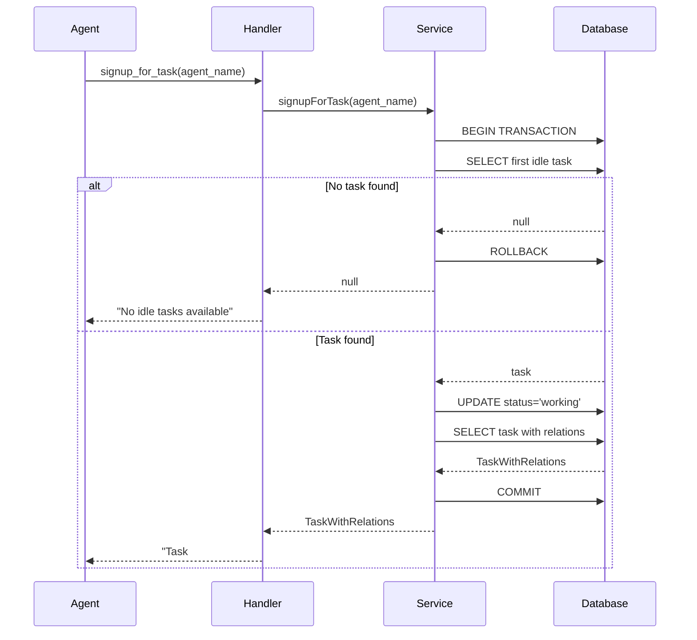
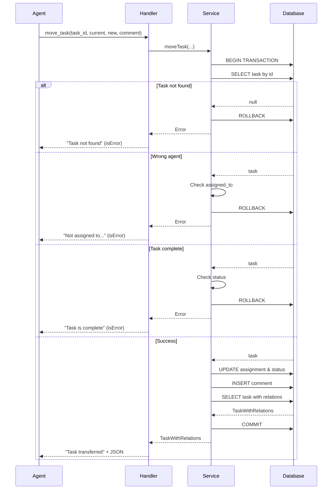

# High-Level Task Tools - Implementation Plan

## Overview

This document provides the detailed implementation plan for two high-level task management tools: `signup_for_task` and `move_task`. These tools combine multiple operations into single atomic transactions to significantly reduce token consumption for common agent workflows.

## Architecture Review

### Existing Patterns
The TinyTask MCP follows a clean layered architecture:
- **Tool Layer** ([`src/tools/task-tools.ts`](../../src/tools/task-tools.ts:1)): Handler functions that process MCP tool calls
- **Service Layer** ([`src/services/task-service.ts`](../../src/services/task-service.ts:1)): Business logic with transaction support
- **Database Layer** ([`src/db/client.ts`](../../src/db/client.ts:1)): SQLite wrapper with transaction API

### Transaction Pattern
The existing codebase uses `this.db.transaction(() => {...})` for atomic operations:
```typescript
return this.db.transaction(() => {
  // All operations here execute atomically
  // Auto-rollback on any error
  return result;
});
```

## Implementation Components

### 1. Service Layer Methods

#### A. signupForTask Method

**Location:** [`src/services/task-service.ts`](../../src/services/task-service.ts:1)

**Signature:**
```typescript
signupForTask(agentName: string): TaskWithRelations | null
```

**Algorithm:**
1. Query for first idle task in agent's queue (priority DESC, created_at ASC)
2. If no task found, return null
3. Update task status to 'working'
4. Return task with comments and links

**SQL Operations:**
```sql
-- Step 1: Find first idle task
SELECT * FROM tasks 
WHERE assigned_to = ? 
  AND status = 'idle'
  AND archived_at IS NULL
ORDER BY priority DESC, created_at ASC
LIMIT 1

-- Step 2: Update to working (if task found)
UPDATE tasks 
SET status = 'working', updated_at = CURRENT_TIMESTAMP 
WHERE id = ?

-- Step 3: Get full task with relations
SELECT * FROM tasks WHERE id = ?
SELECT * FROM comments WHERE task_id = ? ORDER BY created_at ASC
SELECT * FROM links WHERE task_id = ? ORDER BY created_at ASC
```

**Implementation:**
```typescript
/**
 * Sign up for the highest priority idle task in agent's queue
 * Atomically marks the task as 'working' and returns it
 */
signupForTask(agentName: string): TaskWithRelations | null {
  return this.db.transaction(() => {
    // Get first idle task from agent's queue
    const task = this.db.queryOne<Task>(
      `SELECT * FROM tasks 
       WHERE assigned_to = ? 
         AND status = 'idle'
         AND archived_at IS NULL
       ORDER BY priority DESC, created_at ASC
       LIMIT 1`,
      [agentName]
    );

    if (!task) {
      return null;
    }

    // Update task to working status
    this.db.execute(
      'UPDATE tasks SET status = ?, updated_at = CURRENT_TIMESTAMP WHERE id = ?',
      ['working', task.id]
    );

    // Return task with relations
    const updatedTask = this.get(task.id, true);
    if (!updatedTask) {
      throw new Error('Failed to retrieve updated task');
    }

    return updatedTask;
  });
}
```

**Error Handling:**
- Returns `null` if no idle tasks (not an error condition)
- Throws error if task retrieval fails after update
- Transaction auto-rolls back on any error

#### B. moveTask Method

**Location:** [`src/services/task-service.ts`](../../src/services/task-service.ts:1)

**Signature:**
```typescript
moveTask(
  taskId: number,
  currentAgent: string,
  newAgent: string,
  comment: string
): TaskWithRelations
```

**Algorithm:**
1. Verify task exists and is assigned to current_agent
2. Verify task is in 'idle' or 'working' status (not 'complete')
3. Update task assignment to new_agent and status to 'idle'
4. Add handoff comment from current_agent
5. Return updated task with comments and links

**SQL Operations:**
```sql
-- Step 1: Verify task and ownership
SELECT * FROM tasks WHERE id = ?

-- Step 2: Update assignment and status
UPDATE tasks 
SET assigned_to = ?, status = 'idle', updated_at = CURRENT_TIMESTAMP 
WHERE id = ?

-- Step 3: Add handoff comment
INSERT INTO comments (task_id, content, created_by) 
VALUES (?, ?, ?)

-- Step 4: Get full task with relations
SELECT * FROM tasks WHERE id = ?
SELECT * FROM comments WHERE task_id = ? ORDER BY created_at ASC
SELECT * FROM links WHERE task_id = ? ORDER BY created_at ASC
```

**Implementation:**
```typescript
/**
 * Transfer task from current agent to new agent
 * Atomically updates assignment, status, and adds handoff comment
 */
moveTask(
  taskId: number,
  currentAgent: string,
  newAgent: string,
  comment: string
): TaskWithRelations {
  return this.db.transaction(() => {
    // Verify task and ownership
    const task = this.db.queryOne<Task>('SELECT * FROM tasks WHERE id = ?', [taskId]);
    
    if (!task) {
      throw new Error(`Task not found: ${taskId}`);
    }

    if (task.assigned_to !== currentAgent) {
      throw new Error(
        `Task ${taskId} is not assigned to ${currentAgent} (currently assigned to: ${task.assigned_to || 'no one'})`
      );
    }

    if (task.status === 'complete') {
      throw new Error(
        `Task ${taskId} is complete and cannot be transferred`
      );
    }

    // Update task assignment and status
    this.db.execute(
      `UPDATE tasks 
       SET assigned_to = ?, status = 'idle', updated_at = CURRENT_TIMESTAMP 
       WHERE id = ?`,
      [newAgent, taskId]
    );

    // Add handoff comment
    this.db.execute(
      'INSERT INTO comments (task_id, content, created_by) VALUES (?, ?, ?)',
      [taskId, comment.trim(), currentAgent]
    );

    // Return updated task with relations
    const updatedTask = this.get(taskId, true);
    if (!updatedTask) {
      throw new Error('Failed to retrieve updated task');
    }

    return updatedTask;
  });
}
```

**Error Handling:**
- Throws descriptive errors for:
  - Task not found
  - Current agent doesn't match
  - Task is complete (cannot transfer)
- Transaction auto-rolls back on any error

### 2. Tool Handlers

**Location:** [`src/tools/task-tools.ts`](../../src/tools/task-tools.ts:1)

#### A. signupForTaskHandler

```typescript
export async function signupForTaskHandler(
  taskService: TaskService,
  params: SignupForTaskParams
) {
  try {
    const task = taskService.signupForTask(params.agent_name);
    
    if (!task) {
      return {
        content: [
          {
            type: 'text' as const,
            text: `No idle tasks available in queue for agent: ${params.agent_name}`,
          },
        ],
      };
    }

    return {
      content: [
        {
          type: 'text' as const,
          text: `Task #${task.id} claimed and set to working status\n\n${JSON.stringify(task, null, 2)}`,
        },
      ],
    };
  } catch (error) {
    return {
      content: [
        {
          type: 'text' as const,
          text: `Error signing up for task: ${error instanceof Error ? error.message : String(error)}`,
        },
      ],
      isError: true,
    };
  }
}
```

#### B. moveTaskHandler

```typescript
export async function moveTaskHandler(
  taskService: TaskService,
  params: MoveTaskParams
) {
  try {
    const task = taskService.moveTask(
      params.task_id,
      params.current_agent,
      params.new_agent,
      params.comment
    );

    return {
      content: [
        {
          type: 'text' as const,
          text: `Task #${params.task_id} transferred from ${params.current_agent} to ${params.new_agent}\n\n${JSON.stringify(task, null, 2)}`,
        },
      ],
    };
  } catch (error) {
    return {
      content: [
        {
          type: 'text' as const,
          text: `Error moving task: ${error instanceof Error ? error.message : String(error)}`,
        },
      ],
      isError: true,
    };
  }
}
```

### 3. Type Definitions

**Location:** [`src/tools/handler-types.ts`](../../src/tools/handler-types.ts:1)

```typescript
export interface SignupForTaskParams {
  agent_name: string;
}

export interface MoveTaskParams {
  task_id: number;
  current_agent: string;
  new_agent: string;
  comment: string;
}
```

### 4. Tool Definitions

**Location:** [`src/tools/tool-definitions.ts`](../../src/tools/tool-definitions.ts:1)

#### A. Add to toolSchemas object:

```typescript
signup_for_task: z.object({
  agent_name: z.string().describe('Agent name signing up for task'),
}),

move_task: z.object({
  task_id: z.number().describe('Task ID to transfer'),
  current_agent: z.string().describe('Current agent (for verification)'),
  new_agent: z.string().describe('Agent to transfer to'),
  comment: z.string().describe('Handoff message/context'),
}),
```

#### B. Add to toolDefinitions array:

```typescript
{
  name: 'signup_for_task',
  description: 'Claim the highest priority idle task from your queue and mark it as working',
  inputSchema: zodToJsonSchema(toolSchemas.signup_for_task),
},
{
  name: 'move_task',
  description: 'Transfer a task to another agent with status reset to idle and add handoff comment',
  inputSchema: zodToJsonSchema(toolSchemas.move_task),
},
```

### 5. Tool Handler Registration

**Location:** [`src/tools/tool-handlers.ts`](../../src/tools/tool-handlers.ts:1)

#### A. Add imports:

```typescript
import {
  // ... existing imports ...
  signupForTaskHandler,
  moveTaskHandler,
} from './task-tools.js';

import type {
  // ... existing imports ...
  SignupForTaskParams,
  MoveTaskParams,
} from './handler-types.js';
```

#### B. Add cases to switch statement:

```typescript
case 'signup_for_task':
  result = await signupForTaskHandler(taskService, validatedArgs as SignupForTaskParams);
  break;
case 'move_task':
  result = await moveTaskHandler(taskService, validatedArgs as MoveTaskParams);
  break;
```

## Transaction Flow Diagrams

### signup_for_task Flow



### move_task Flow



## Test Strategy

### Unit Tests (Service Layer)

**File:** `tests/integration/high-level-tools.test.ts` (new file)

#### signup_for_task tests:
1. ✅ Returns first idle task and updates to working
2. ✅ Returns null when no idle tasks available
3. ✅ Respects priority ordering (higher priority first)
4. ✅ Respects creation time ordering (older first within same priority)
5. ✅ Ignores tasks not assigned to agent
6. ✅ Ignores archived tasks
7. ✅ Ignores tasks already in working status
8. ✅ Ignores tasks in complete status
9. ✅ Transaction rollback on error
10. ✅ Multiple agents can claim different tasks concurrently

#### move_task tests:
1. ✅ Successfully transfers task from idle status
2. ✅ Successfully transfers task from working status
3. ✅ Changes status from working to idle
4. ✅ Changes status from idle to idle (stays idle)
5. ✅ Adds comment with handoff message
6. ✅ Comment is attributed to current_agent
7. ✅ Throws error if task not found
8. ✅ Throws error if current agent doesn't match
9. ✅ Throws error if task is complete
10. ✅ Transaction rollback on error
11. ✅ Validates comment is stored correctly

### Integration Tests (Tool Handlers)

**File:** `tests/integration/high-level-tools.test.ts`

#### signup_for_task tool tests:
1. ✅ Tool call returns proper response format
2. ✅ Tool call with no tasks returns appropriate message
3. ✅ Tool call claims correct task from queue
4. ✅ Multiple agents don't claim same task

#### move_task tool tests:
1. ✅ Tool call returns proper response format
2. ✅ Tool call validation errors are handled
3. ✅ Tool call successfully transfers task
4. ✅ Comment is added correctly via tool

### Workflow Tests

**File:** `tests/integration/workflow.test.ts` (additions)

1. ✅ Complete agent handoff: Agent A uses signup_for_task → Agent A uses move_task → Agent B uses signup_for_task
2. ✅ Multiple agents competing for tasks (no conflicts)
3. ✅ Transfer chain: Agent A → Agent B → Agent C
4. ✅ Token savings verification (count tool calls)

### Performance Tests

**File:** `tests/performance/load.test.ts` (additions)

1. ✅ signup_for_task completes in < 100ms
2. ✅ move_task completes in < 100ms
3. ✅ Concurrent signup attempts (10 agents, 5 tasks)
4. ✅ High volume transfers (100 transfers)

## Implementation Sequence

### Phase 1: Service Layer
1. Add `signupForTask` method to TaskService
2. Add `moveTask` method to TaskService
3. Test service methods thoroughly

### Phase 2: Tool Layer
1. Add type definitions to handler-types.ts
2. Add tool handlers to task-tools.ts
3. Add Zod schemas to tool-definitions.ts
4. Add tool definitions to tool-definitions.ts
5. Register handlers in tool-handlers.ts

### Phase 3: Testing
1. Write service layer tests
2. Write tool integration tests
3. Write workflow tests
4. Write performance tests
5. Verify all tests pass

### Phase 4: Documentation
1. Update README.md with new tools
2. Add usage examples to docs/examples/workflows.md
3. Update CHANGELOG.md
4. Update technical documentation

## Success Criteria

### Code Quality
- ✅ All TypeScript compiles without errors
- ✅ ESLint passes with no warnings
- ✅ Prettier formatting applied
- ✅ No use of `any` in production code

### Testing
- ✅ All tests pass (unit, integration, workflow, performance)
- ✅ Test coverage maintained or improved
- ✅ No breaking changes to existing tests

### Functionality
- ✅ signup_for_task claims correct task atomically
- ✅ move_task transfers task with comment atomically
- ✅ Error handling works as specified
- ✅ Transaction rollback works correctly
- ✅ No partial state changes possible

### Performance
- ✅ Both tools execute in < 100ms
- ✅ No degradation to existing tool performance
- ✅ Token savings of 40-60% verified

### Documentation
- ✅ All new code documented with JSDoc comments
- ✅ Usage examples provided
- ✅ CHANGELOG updated
- ✅ README updated

## Risk Mitigation

### Transaction Locking
**Risk:** Concurrent access could cause lock contention
**Mitigation:** 
- SQLite WAL mode already enabled (concurrent reads)
- Transactions are short-lived (< 100ms)
- busy_timeout set to 30 seconds
- Test concurrent access scenarios

### Data Consistency
**Risk:** Partial updates if transaction fails
**Mitigation:**
- All operations wrapped in transactions
- Automatic rollback on error
- Comprehensive error handling
- Test transaction rollback scenarios

### Backward Compatibility
**Risk:** Breaking existing functionality
**Mitigation:**
- No changes to existing tools
- Additive changes only
- Maintain all existing tests
- Run full test suite before completion

## Token Savings Analysis

### Current Workflow Costs

**Signup (3 tool calls):**
1. get_my_queue: ~500-800 tokens
2. update_task: ~300-500 tokens
3. get_task: ~400-600 tokens
**Total: ~1200-1900 tokens**

**Transfer (3 tool calls):**
1. update_task: ~300-500 tokens
2. add_comment: ~200-300 tokens
3. get_task: ~400-600 tokens
**Total: ~900-1400 tokens**

### New Workflow Costs

**Signup (1 tool call):**
1. signup_for_task: ~500-800 tokens
**Savings: 700-1100 tokens (58-58% reduction)**

**Transfer (1 tool call):**
1. move_task: ~500-800 tokens
**Savings: 400-600 tokens (44-43% reduction)**

### Projected Impact
- **Per agent per day:** 10 signups + 3 transfers = 9,200-14,300 tokens saved
- **5-agent system per day:** 46,000-71,500 tokens saved
- **Monthly (5 agents):** ~1.4-2.1 million tokens saved

## Implementation Checklist

### Code Changes
- [ ] Add signupForTask method to TaskService
- [ ] Add moveTask method to TaskService
- [ ] Add SignupForTaskParams and MoveTaskParams types
- [ ] Add signupForTaskHandler function
- [ ] Add moveTaskHandler function
- [ ] Add signup_for_task Zod schema
- [ ] Add move_task Zod schema
- [ ] Add signup_for_task tool definition
- [ ] Add move_task tool definition
- [ ] Register signup_for_task handler
- [ ] Register move_task handler

### Testing
- [ ] Write service layer tests for signupForTask
- [ ] Write service layer tests for moveTask
- [ ] Write tool integration tests for signup_for_task
- [ ] Write tool integration tests for move_task
- [ ] Write workflow tests for handoff scenarios
- [ ] Write performance tests for both tools
- [ ] Run full test suite
- [ ] Verify no regressions

### Documentation
- [ ] Update README.md
- [ ] Update docs/examples/workflows.md
- [ ] Update CHANGELOG.md
- [ ] Add JSDoc comments to all new code

### Validation
- [ ] Build succeeds: `npm run build`
- [ ] All tests pass: `npm test`
- [ ] Linting passes: `npm run lint`
- [ ] Formatting applied: `npm run format`
- [ ] No TypeScript errors

## References

- Product Story: [`docs/product-stories/high-level-tools/story-01-high-level-task-tools.md`](../product-stories/high-level-tools/story-01-high-level-task-tools.md:1)
- Technical Design: [`docs/technical/high-level-task-tools.md`](./high-level-task-tools.md:1)
- Service Layer: [`src/services/task-service.ts`](../../src/services/task-service.ts:1)
- Tool Handlers: [`src/tools/task-tools.ts`](../../src/tools/task-tools.ts:1)
- Database Client: [`src/db/client.ts`](../../src/db/client.ts:1)
- Agent Rules: [`agents.md`](../../agents.md:1)
