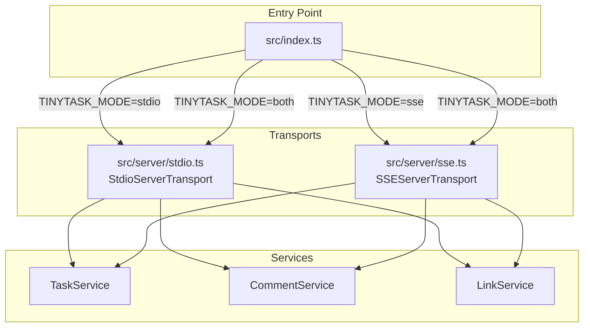
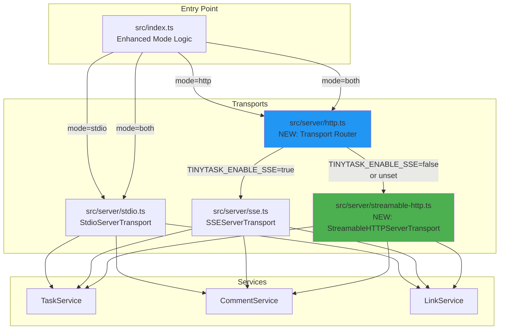
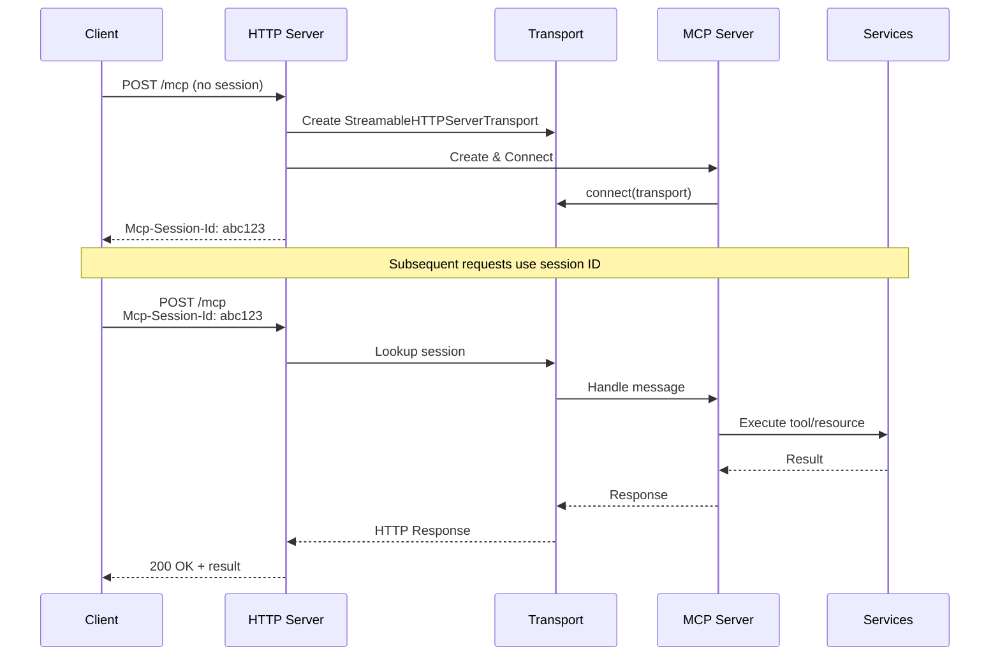

# Streamable HTTP Transport Design

## Overview
This document outlines the design for adding Streamable HTTP transport support to TinyTask MCP, replacing SSE as the default HTTP transport while maintaining backward compatibility via runtime configuration.

## Problem Statement
The current TinyTask MCP server uses SSE (Server-Sent Events) for HTTP transport, which requires:
- Two separate endpoints (GET for event stream, POST for messages)
- Long-lived persistent connections per client
- Complex dual-channel management logic
- Higher resource usage under load

The MCP SDK now provides Streamable HTTP transport, which offers:
- Single unified endpoint (`/mcp`)
- Optional streaming on a single connection
- Better scalability with fewer persistent connections
- Simpler client/server logic
- Native session management with resumption support

## Goals
1. **Implement Streamable HTTP transport** as the new default for HTTP mode
2. **Maintain backward compatibility** by allowing SSE via configuration flag
3. **Prevent transport conflicts** by ensuring only one HTTP transport is active
4. **Minimize code duplication** by reusing service layer
5. **Maintain existing functionality** for stdio mode
6. **Preserve all current MCP tools and resources**

## Non-Goals
- Modifying the database layer or service layer
- Changing the MCP protocol or tool definitions
- Supporting both SSE and Streamable HTTP simultaneously
- Modifying stdio transport implementation

## Architecture

### Current Architecture



### Proposed Architecture



## Configuration Design

### Environment Variables

#### Existing Variables (No Change)
- `TINYTASK_MODE`: Server mode (`stdio`, `http`, `both`)
  - **Change:** `sse` value deprecated but still supported for backward compatibility
  - Maps internally to `http` mode with `TINYTASK_ENABLE_SSE=true`
- `TINYTASK_PORT`: HTTP server port (default: `3000`)
- `TINYTASK_HOST`: HTTP server host (default: `0.0.0.0`)
- `TINYTASK_DB_PATH`: Database path (default: `./data/tinytask.db`)
- `TINYTASK_LOG_LEVEL`: Logging level (default: `info`)

#### New Variables
- `TINYTASK_ENABLE_SSE`: Enable legacy SSE transport (default: `false`)
  - `true`: Use SSE transport for HTTP mode
  - `false` or unset: Use Streamable HTTP transport for HTTP mode (default)

### Configuration Matrix

| TINYTASK_MODE | TINYTASK_ENABLE_SSE | Active Transports | Notes |
|---------------|---------------------|-------------------|-------|
| `stdio` | any | Stdio only | ENABLE_SSE ignored |
| `http` | `true` | HTTP (SSE) | Legacy SSE mode |
| `http` | `false` or unset | HTTP (Streamable) | **New default** |
| `both` | `true` | Stdio + HTTP (SSE) | Legacy both mode |
| `both` | `false` or unset | Stdio + HTTP (Streamable) | **New default** |
| `sse` (deprecated) | any | HTTP (SSE) | Backward compat, logs warning |

### Migration Path

#### For Users Currently Using SSE
```bash
# Option 1: No change needed if using TINYTASK_MODE=sse (logs deprecation warning)
TINYTASK_MODE=sse node build/index.js

# Option 2: Explicitly enable SSE (recommended for clarity)
TINYTASK_MODE=http TINYTASK_ENABLE_SSE=true node build/index.js

# Option 3: Migrate to new default (Streamable HTTP)
TINYTASK_MODE=http node build/index.js
```

#### For Users Currently Using Both Mode
```bash
# Old way (still works, uses SSE)
TINYTASK_MODE=both node build/index.js

# Explicitly use SSE
TINYTASK_MODE=both TINYTASK_ENABLE_SSE=true node build/index.js

# Migrate to Streamable HTTP (new default)
TINYTASK_MODE=both node build/index.js
# or
TINYTASK_MODE=both TINYTASK_ENABLE_SSE=false node build/index.js
```

## Implementation Plan

### Phase 1: Create Streamable HTTP Transport Module

#### File: `src/server/streamable-http.ts`

**Key Components:**
1. **`startStreamableHttpServer()` function**
   - Similar signature to `startSseServer()` in [`src/server/sse.ts`](src/server/sse.ts:24)
   - Takes `TaskService`, `CommentService`, `LinkService`, and `options`
   - Returns `Promise<void>`

2. **Express.js HTTP server setup**
   - Single unified `/mcp` endpoint
   - Health check endpoint at `/health`
   - CORS support

3. **Session management**
   - Use `Mcp-Session-Id` header
   - Store active transports by session ID
   - Each session gets its own MCP Server instance

4. **Request handling**
   - **POST `/mcp`**: Handle incoming MCP protocol messages
   - **GET `/mcp`**: Establish streaming connection (if needed)
   - Session ID from header: `Mcp-Session-Id`

**Key Differences from SSE:**
- Use `StreamableHTTPServerTransport` instead of `SSEServerTransport`
- Single endpoint handles both directions (no separate GET for events)
- Session management via standard HTTP headers
- Less complex connection lifecycle

### Phase 2: Create HTTP Transport Router

#### File: `src/server/http.ts`

**Purpose:** Abstract layer that decides which HTTP transport to use based on configuration

```typescript
/**
 * Start HTTP transport with appropriate implementation
 * based on TINYTASK_ENABLE_SSE environment variable
 */
export async function startHttpServer(
  taskService: TaskService,
  commentService: CommentService,
  linkService: LinkService,
  options?: HttpServerOptions
): Promise<void> {
  const enableSse = process.env.TINYTASK_ENABLE_SSE === 'true';
  
  if (enableSse) {
    logger.info('Using SSE transport (legacy mode)');
    return startSseServer(taskService, commentService, linkService, options);
  } else {
    logger.info('Using Streamable HTTP transport');
    return startStreamableHttpServer(taskService, commentService, linkService, options);
  }
}
```

### Phase 3: Update Entry Point

#### File: `src/index.ts`

**Changes:**
1. **Mode normalization**
   - Map `sse` → `http` + set `TINYTASK_ENABLE_SSE=true` internally
   - Log deprecation warning for `sse` mode

2. **Mode validation**
   - Update valid modes: `['stdio', 'http', 'both']`
   - Accept `'sse'` for backward compatibility

3. **Transport startup logic**
   ```typescript
   // Replace direct SSE calls with HTTP router
   if (mode === 'http' || mode === 'both') {
     console.error('Starting HTTP transport...');
     await startHttpServer(taskService, commentService, linkService, { port, host });
     console.error('✓ HTTP transport started');
   }
   ```

### Phase 4: Update Package Scripts

#### File: `package.json`

**Changes:**
```json
{
  "scripts": {
    "start": "node build/index.js",
    "start:stdio": "TINYTASK_MODE=stdio node build/index.js",
    "start:http": "TINYTASK_MODE=http node build/index.js",
    "start:http:sse": "TINYTASK_MODE=http TINYTASK_ENABLE_SSE=true node build/index.js",
    "start:both": "TINYTASK_MODE=both node build/index.js",
    "start:both:sse": "TINYTASK_MODE=both TINYTASK_ENABLE_SSE=true node build/index.js",
    
    "start:sse": "echo 'DEPRECATED: Use start:http:sse instead' && TINYTASK_MODE=http TINYTASK_ENABLE_SSE=true node build/index.js"
  }
}
```

### Phase 5: Update Documentation

#### Files to Update:
1. **README.md** - Update transport documentation
2. **docs/technical/architecture.md** - Update architecture diagrams
3. **docs/deployment.md** - Update deployment examples
4. **agents.md** - Update environment variables section

## Technical Details

### Streamable HTTP vs SSE Implementation Comparison

| Aspect | SSE (Current) | Streamable HTTP (New) |
|--------|---------------|------------------------|
| **SDK Import** | `@modelcontextprotocol/sdk/server/sse.js` | `@modelcontextprotocol/sdk/server/streamableHttp.js` |
| **Transport Class** | `SSEServerTransport` | `StreamableHTTPServerTransport` |
| **Endpoints** | GET `/mcp` (stream)<br/>POST `/mcp` (messages) | Unified `/mcp` (both) |
| **Session ID** | `transport.sessionId` | `Mcp-Session-Id` header |
| **Connection Model** | Long-lived SSE stream | On-demand streaming |
| **Client Complexity** | Dual channel management | Single endpoint |
| **Scalability** | More connections | Fewer connections |

### Streamable HTTP Server Implementation

```typescript
import { StreamableHTTPServerTransport } from '@modelcontextprotocol/sdk/server/streamableHttp.js';
import express from 'express';
import { createMcpServer } from './mcp-server.js';

export async function startStreamableHttpServer(
  taskService: TaskService,
  commentService: CommentService,
  linkService: LinkService,
  options?: HttpServerOptions
): Promise<void> {
  const app = express();
  const port = options?.port ?? parseInt(process.env.TINYTASK_PORT || '3000');
  const host = options?.host ?? process.env.TINYTASK_HOST ?? '0.0.0.0';

  // Session management
  const sessions = new Map<string, { transport: StreamableHTTPServerTransport; server: Server }>();

  // Middleware
  app.use(express.json());
  app.use(cors());

  // Health check
  app.get('/health', (req, res) => {
    res.json({ status: 'healthy', transport: 'streamable-http' });
  });

  // Unified MCP endpoint
  app.use('/mcp', async (req, res) => {
    // Extract or create session ID from Mcp-Session-Id header
    let sessionId = req.headers['mcp-session-id'] as string;
    
    let session = sessions.get(sessionId);
    
    if (!session) {
      // Create new session
      const transport = new StreamableHTTPServerTransport();
      const server = createMcpServer(taskService, commentService, linkService);
      await server.connect(transport);
      
      sessionId = generateSessionId(); // Use UUID or similar
      session = { transport, server };
      sessions.set(sessionId, session);
      
      // Set session ID in response
      res.setHeader('Mcp-Session-Id', sessionId);
    }
    
    // Let transport handle the request/response
    await session.transport.handleRequest(req, res);
  });

  // Start server
  app.listen(port, host, () => {
    logger.info(`TinyTask MCP server running on Streamable HTTP`);
    logger.info(`URL: http://${host}:${port}/mcp`);
  });
}
```

### Session Lifecycle



## Testing Strategy

### Unit Tests

#### Test File: `tests/unit/streamable-http-transport.test.ts`
- Transport initialization
- Session creation and management
- Request/response handling
- Error handling
- Session cleanup

### Integration Tests

#### Test File: `tests/integration/streamable-http-mode.test.ts`
- Full server startup with Streamable HTTP
- Tool execution via Streamable HTTP
- Resource access via Streamable HTTP
- Session persistence across requests
- Concurrent client sessions

### Configuration Tests

#### Test File: `tests/integration/transport-configuration.test.ts`
- `TINYTASK_ENABLE_SSE=true` activates SSE
- `TINYTASK_ENABLE_SSE=false` activates Streamable HTTP
- Unset `TINYTASK_ENABLE_SSE` defaults to Streamable HTTP
- Legacy `TINYTASK_MODE=sse` still works (with warning)

### Backward Compatibility Tests

#### Test File: `tests/integration/backward-compatibility.test.ts`
- Existing SSE clients continue to work
- Both mode with SSE flag works
- Deprecation warnings are logged
- Configuration migration paths work

## Rollout Plan

### Stage 1: Development (Week 1)
- [ ] Implement Streamable HTTP transport module
- [ ] Implement HTTP transport router
- [ ] Update entry point logic
- [ ] Write unit tests

### Stage 2: Integration (Week 2)
- [ ] Integration testing
- [ ] Backward compatibility verification
- [ ] Performance comparison (SSE vs Streamable HTTP)
- [ ] Update documentation

### Stage 3: Alpha Release
- [ ] Deploy to test environment
- [ ] Test with sample agents
- [ ] Gather feedback
- [ ] Fix issues

### Stage 4: Beta Release
- [ ] Update Docker images
- [ ] Update deployment examples
- [ ] Communication to users about migration
- [ ] Monitoring and bug fixes

### Stage 5: GA Release
- [ ] Mark SSE as officially deprecated
- [ ] Announce Streamable HTTP as default
- [ ] Provide migration guide
- [ ] Set timeline for SSE removal (if any)

## Migration Guide

### For Current SSE Users

#### Immediate Action (No Code Changes)
Your current setup will continue to work. The system will automatically enable SSE mode when it detects `TINYTASK_MODE=sse`.

**You will see a deprecation warning:**
```
⚠️  TINYTASK_MODE=sse is deprecated. Please use TINYTASK_MODE=http with TINYTASK_ENABLE_SSE=true
```

#### Recommended Action (Update Configuration)
Update your configuration to be explicit about using SSE:

**Before:**
```bash
TINYTASK_MODE=sse
TINYTASK_PORT=3000
```

**After:**
```bash
TINYTASK_MODE=http
TINYTASK_ENABLE_SSE=true
TINYTASK_PORT=3000
```

#### Future Action (Migrate to Streamable HTTP)
When ready, simply remove the `TINYTASK_ENABLE_SSE` flag:

```bash
TINYTASK_MODE=http
TINYTASK_PORT=3000
```

**Benefits of migrating:**
- Better scalability with fewer persistent connections
- Simpler client configuration
- More efficient resource usage
- Better session management

### For New Users
Simply use the default configuration:

```bash
TINYTASK_MODE=http  # or 'both' for stdio + http
TINYTASK_PORT=3000
```

This will automatically use Streamable HTTP transport.

## Risks and Mitigations

### Risk 1: Breaking Changes for Existing Users
**Mitigation:** Maintain full backward compatibility with automatic SSE mode detection

### Risk 2: Streamable HTTP Bugs
**Mitigation:** Thorough testing, keep SSE available as fallback, gradual rollout

### Risk 3: Client Compatibility
**Mitigation:** Verify MCP SDK version compatibility, update documentation

### Risk 4: Performance Regression
**Mitigation:** Performance testing before rollout, monitoring in production

### Risk 5: Documentation Gaps
**Mitigation:** Comprehensive documentation updates, migration guide, examples

## Success Metrics

### Technical Metrics
- [ ] All existing tests pass
- [ ] New tests achieve >90% coverage
- [ ] No increase in error rates
- [ ] Reduced connection count in http mode
- [ ] Improved response times (target: 10-20% improvement)

### User Metrics
- [ ] Zero breaking changes for existing deployments
- [ ] Clear migration documentation
- [ ] Positive user feedback
- [ ] Successful migration of test environments

## Open Questions

1. **Should we set a timeline for removing SSE support entirely?**
   - Recommendation: Keep SSE for at least 6 months after Streamable HTTP is stable

2. **Should we provide a tool to test both transports side-by-side?**
   - Recommendation: Create a simple test script that validates both

3. **How should we handle monitoring/metrics for different transport types?**
   - Recommendation: Add transport type to all log messages

4. **Should we support custom transport implementations via plugins?**
   - Recommendation: Not for MVP, consider for future

## References

- [MCP Specification - Transports](https://modelcontextprotocol.io/docs/concepts/transports)
- [MCP SDK TypeScript Documentation](https://github.com/modelcontextprotocol/typescript-sdk)
- [Streamable HTTP vs SSE Comparison](https://blog.fka.dev)
- Current TinyTask Implementation: [`src/server/sse.ts`](src/server/sse.ts:1)
- Current Entry Point: [`src/index.ts`](src/index.ts:1)
